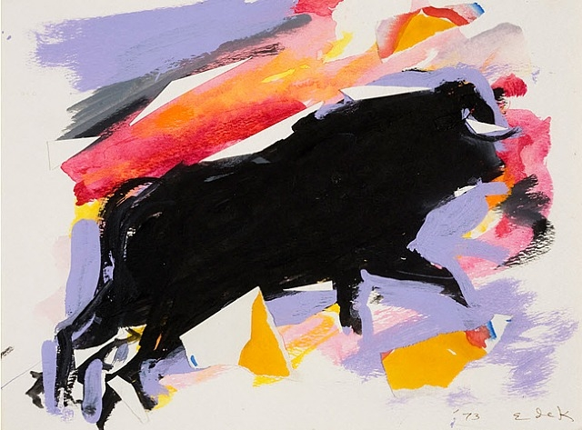

# Quiz-9
# Quiz 8 – Imaging and Coding Technique Research

## 🎨 Part 1: Imaging Technique Inspiration

I am inspired by the bold, gestural abstraction in *Untitled Bull* by **Elaine de Kooning**, combined with the flat color blocking and line work typical of **pop art** (e.g. Andy Warhol’s *Do It Yourself (Violin)*). I aim to reinterpret the bull using abstract shapes, expressive brush-like movement, and bold contouring. These aesthetics help me explore dynamic identity and bodily fragmentation through form.

*Elaine de Kooning, Untitled Bull*

*Andy Warhol, Do It Yourself (Violin), 1962*

---

## 🧠 Part 2: Coding Technique Exploration

To bring the abstraction to life, I will use **poseNet body-tracking in p5.js** to allow user motion to deform and recompose the abstract bull form. This interactive approach brings energy and participation, echoing the playfulness of pop art. I'm also inspired by **scanner-style wave distortion** and **ASCII symbol rendering**, which offer alternative ways to abstract visual forms.

### ✅ Main Technique: poseNet + abstract form mapping
- Link: [poseNet Creative Sketches – perthirtysix.com](https://perthirtysix.com/explore-creative-coding-with-30-p5js-sketches)  
- Screenshot:  
  

### 🌀 Additional Inspiration: Scanner Effect
- Link: [YouTube – Easy Generative Art and Scanner Effect](https://www.youtube.com/watch?v=zJnSwHnYLhs)  
- Code: [GitHub – scan-art](https://github.com/kenjihiranabe/scan-art)  
- Screenshot:  
  

### 🔠 Additional Inspiration: ASCII Art Rendering
- Link: [YouTube – ASCII Text Images and Videos](https://www.youtube.com/watch?v=4IyeLc6J1Uo)  
- Code: [ASCII Image Example on p5.js Editor](https://editor.p5js.org/aaronmt/sketches/EeAIM5LOp)  
- Screenshot:  
  

---

### 📝 Commit Label: `Quiz 8`

Push this file to your GitHub repository as `README.md`, commit with the label above, and submit the repository link as instructed.